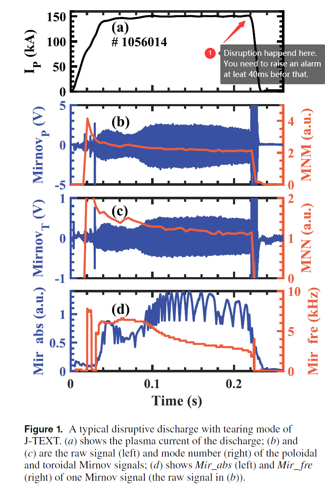
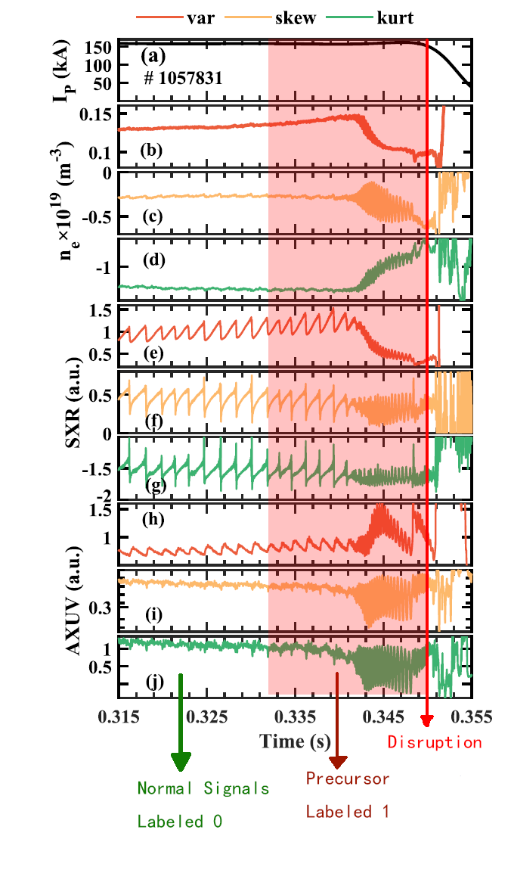
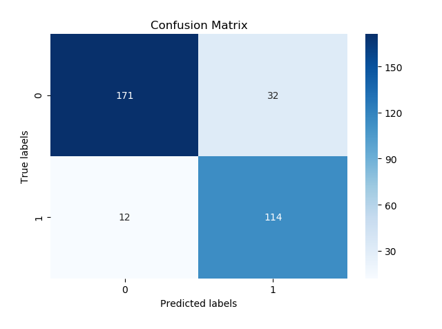
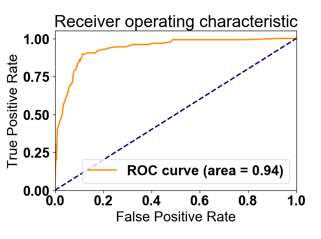
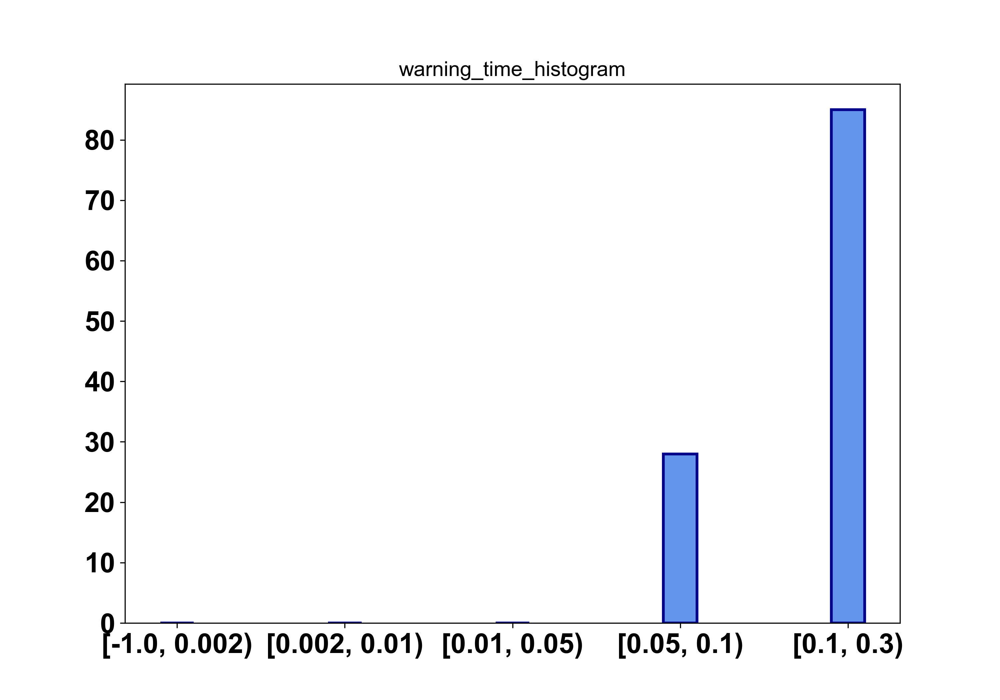
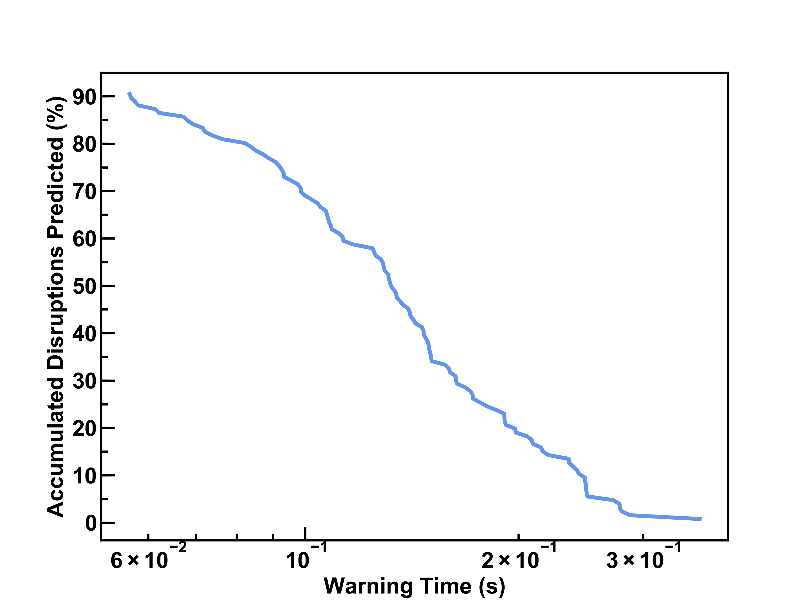

# ITU Disruption Challenge Example

## What is disruption and how to predict them (in this challenge)

Disruption is a event in tokamak operation that is a sudden lose of the plasma current (Ip). You can find a disruption in the fig. below. Disruption is bad so you need to predict an incoming disruption and raise an alarm to trigger the disruption mitigation system (DMS). It just like driving a car, when you predict a collision is un-avoidable, you deploy the airbag, instead of deploy it on impact.

Using Ip along is definitely inadequate to predict the disruption. In tokamak experiment, when have many instruments to measure different properties of the plasma in it. Those instruments are called diagnostics. One tokamak experiment is called a shot, which is a plasma discharge ranging from less than 1s to a few thousands of second -in this challenge, less than 10s-. It produces thousands of channels of time series data. In this challenge we put a sub set of the measurements in one HDF5 file for each shot, the file name is the shot number -identifier for a shot-. Each channel is a diagnostic measurement. They are aligned in time, but may have different sampling rate, check the sample rate attribute of the data channel for detail.

As shown in the fig. below, each sub plot is a diagnostic measurement, the measure different physics properties. Your job is that in each time step -preferably 1ms interval-, take the current measurements feed it to you model an predict if a disruption is coming. You can use a sliding window or using all past measurements, but you cannot use measurements in the future, that would be cheating. One more thing you can see in the fig. below is the orange plot lines. They are extracted features. How to extract the features are up to you and end to end model using raw data is an option.

**How to prepare the data and train the disruption prediction mdoel?**

Fig. below is a zoomed in view of the measurement approaching disruption. The red vertical line marks the disruption. Before that in the red shaded part you can see clear precursors. So to train the model you need to label each time step as precursor -positive samples- or not -negative samples-. But precursors are subtle and manually label it is not feasible. So in practice, we just label a few ms before disruption as positive. Everything else -non-disruption shots and time long before disruption in disruption shots- is labeled negative.

Here is a general guide: for J-TEXT label last 50ms before disruption as positive, for c-mod and HL-2A it's 100ms. But different label methods affect the performance a lot. This is where you can tune and get improvements.

After labeling each time step in the shots, you can train you model the way you like. But in inference time, you feed the model each time step consecutively, when you got an positive output, you can raise an alarm. The reset of the time series can be ignored since you already determined this shot as an disruption. But to avoid being affected by noise you can count for a few positive in a roll to raise the alarm. But this could delay the alarm. You need to trigger the DMS at least 40ms before disruption -in this challenge and for c-mod data-.

So you train on sample of time step, but the final inference output is on shot. So when you submit you result you output predictions for each shot. If an alarm is raised for a shot then it is a positive, if no alarm is raised, it's a negative. Note that, in the test data of the challenge, the disruption labels for the shot is removed. And, the data is clipped 40ms before disruption or Ip ramp down for non-disruptions. So you can not tell if this shot is a disruption or not. Since the data within 40ms before the ramp down or disruption is dropped, when doing inference, you can use up the last time step. When the alarm is raised at last time step, it is still 40ms before disruption, it's still a valid alarm. However, when you raise an alarm too early it should be regarded as a lucky guess. But in this challenge we ignore that, so you have a lucky guess it's also considered as a true positive.

The result of the shot, should be output in a csv file for Zindi platform to evaluate. First column is just the index, the second column is the shot number, the last is your prediction. You can find one example in this repo, file name "test_result.csv".

## Example Project Description

This project contains two main files: a freq_main_processing.py file and
a model_traning_eval.py file. The processing file is used to preprocess raw data
for model training, while the model training and evaluation file converts the
preprocessed data into a matrix format suitable for training a LightGBM model and
evaluates the performance of the trained model.

## Files

1. `freq_main_processing.py`: This file contains the code for processing the raw
   data. It performs tasks such as data cleaning, feature engineering, and data
   transformation to prepare the data for model training.

2. `model_traning_eval.py`: This file is responsible for training a LightGBM model
   using the preprocessed data. It converts the data into a matrix format that can be
   consumed by the LightGBM library. Additionally, it evaluates the performance of
   the trained model using suitable metrics.

## Folder

1. `util`: this folder contains the processors which are used in
   'freq_main_processing.py'

## Usage

**NOTE: The 2 ipython notebooks are more readable.**

1. Run the `freq_main_processing.py` script to preprocess the raw data. Make sure
   to provide the necessary input data files or modify the code to fetch the data
   from the appropriate source. The processed data will be stored in a format
   suitable for the model training and evaluation step.

2. Once the data has been processed, run the `model_traning_eval.py` script.
   Ensure that the processed data files are accessible by the script. The script
   will train a LightGBM model using the processed data and output the evaluation
   results, such as accuracy, precision, recall, or any other relevant metrics.

## Evaluation

### Confusion Matrix

### ROC Curve

### Histogram Warning Time

### Accumulate Warning Time

## Requirements

- JDDB
